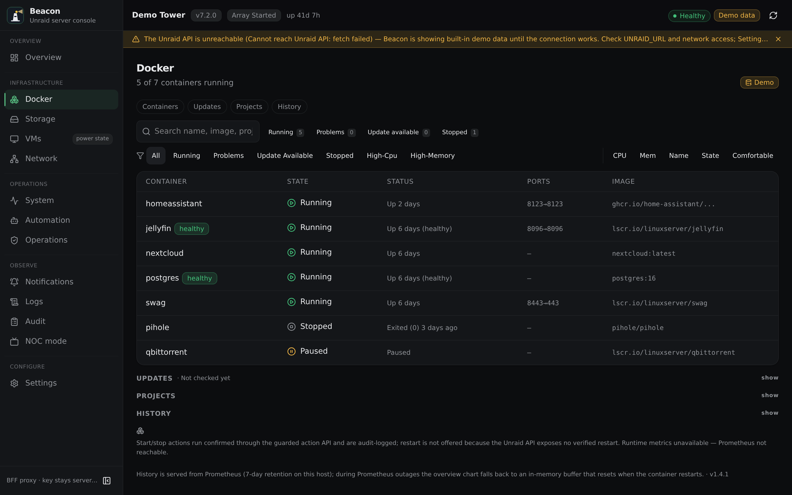
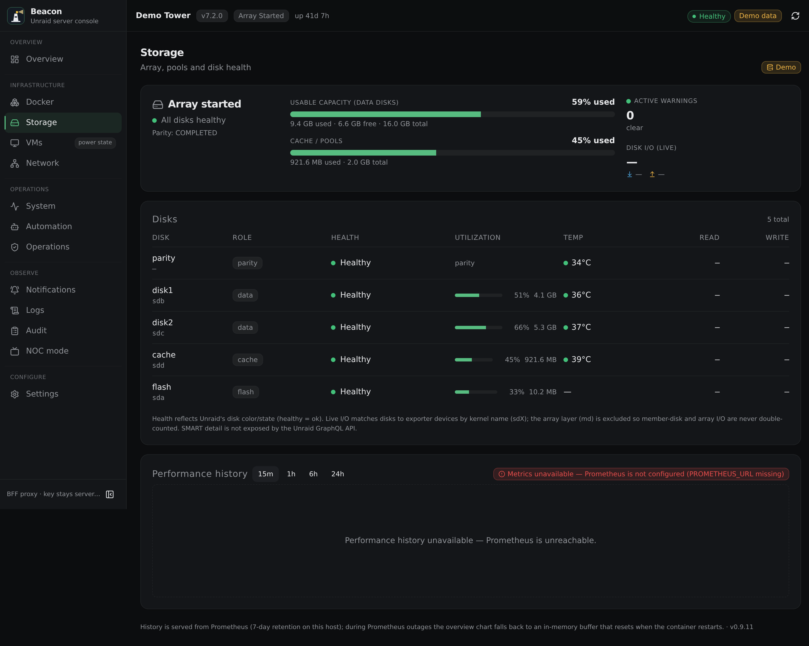
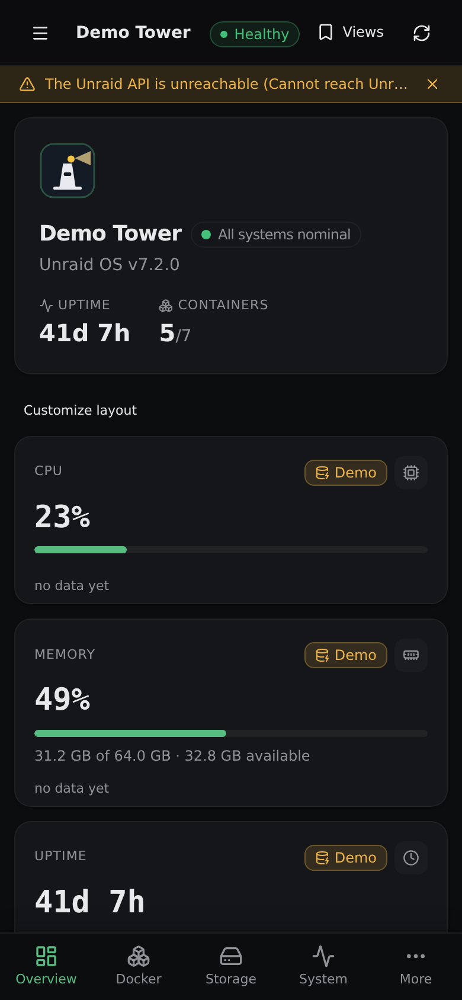
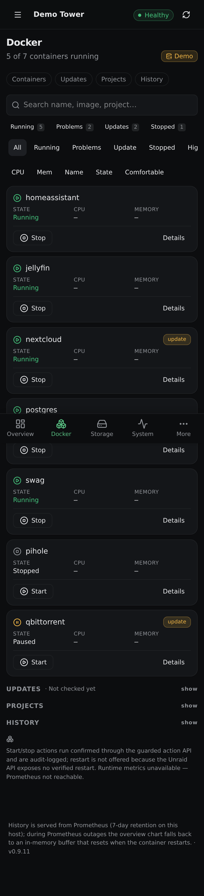

# Beacon

A modern, self-hosted operations dashboard for Unraid — Docker, storage,
VMs, network and system health in one dark-first, installable web app.

[](https://github.com/Cyxno/unraid-dashboard/releases/latest)
[](https://github.com/Cyxno/unraid-dashboard/actions/workflows/ci.yml)
[](LICENSE)
[](https://docs.unraid.net)

<p align="center">
  
</p>
<p align="center"><em>Docker operations — the whole fleet at a glance, with confirmed start/stop and update awareness.</em></p>

## What is Beacon?

Beacon is a modern web interface and operations dashboard for Unraid 7.x
servers, focused on observability and safe operational workflows: container
visibility, storage and thermal health, verified updates and a read-only
machine API — behind a backend that keeps your Unraid API key on the server
and never sends it to the browser.

> The app is called **Beacon**. The repository, container image and package
> keep the original project name `unraid-dashboard`
> (`ghcr.io/cyxno/unraid-dashboard`).

## Highlights

- **Incident intelligence (v1.5.0)** — every warning/critical is an incident with evidence, source, freshness, impact, timeline and a safe next check; source outages collapse into one root incident instead of a cascade; the Incident Center replaces scattered problem lists
- **System overview** — metric cards, resource history, storage summary and an incident-derived health verdict
- **Docker visibility** — searchable, filterable fleet with live CPU/memory, compose grouping and confirmed start/stop; healthcheck explainability (failing streak, exit code, bounded output) on unhealthy containers; crash-loop detection on proven patterns only
- **Storage monitoring** — array and cache usage, per-disk status and temperatures, parity state
- **VMs and network** — at-a-glance visibility, read-only by design; VM workload is never attributed to containers
- **System and thermal health** — load/CPU history, package-temperature analysis, thermal episodes with "correlated with" workload evidence
- **Source diagnostics** — per-source health (status, last success, age, latency, safe error), observability confidence and a persistence self-check; a sanitized support bundle on demand
- **Notifications** — opt-in Web Push for critical conditions, recovery events and updates, incident-aware and deduped on incident fingerprints, with per-device subscriptions and a notification history
- **Operations** — verified updates (registry digest match, automatic rollback) and opt-in pilot auto-update
- **NOC mode** — read-only wallboard for always-on displays
- **Mobile and PWA** — installable app with mobile-first shells and live SSE updates
- **Demo mode** — explore a full synthetic dataset without an Unraid server

## Screenshots

All screenshots use Beacon's built-in synthetic demo data — no real server
data is included.

### Desktop

<p align="center">
  
</p>
<p align="center"><em>Storage — array and cache usage, per-disk status and temperatures, parity state.</em></p>

### Mobile

<p align="center">
  
  
</p>
<p align="center"><em>Overview and Docker at phone width (390&nbsp;px viewport).</em></p>

More screenshots — overview, system, automation, settings, changelog and the
NOC wallboard — are available in [docs/screenshots/](docs/screenshots/).

## Install Beacon

Beacon is one product shipped as two containers: the **dashboard** (the web
app) and an optional, localhost-only **update helper** — the only component
with Docker-socket access, used for verified in-app updates and automatic
rollback.

The compose bundle installs both as one stack (amd64 images):

```sh
git clone https://github.com/Cyxno/unraid-dashboard.git
cd unraid-dashboard
cp .env.example .env
# edit .env: set UNRAID_API_KEY (read-only is enough) and — for in-app
# updates — UPDATE_HELPER_TOKEN (openssl rand -hex 32)
docker compose up -d
```

Open `http://<server>:8090`. Full walkthrough, including the key setup:
[docs/INSTALL.md](docs/INSTALL.md).

Using Beacon privately over Tailscale? [Tailscale Serve](docs/TAILSCALE.md)
provides a tailnet-only HTTPS origin — enabling installed-PWA and Web Push
notifications without exposing Beacon publicly.

Other supported paths:

- **Unraid 7.2+** — Docker → Compose → Add New Stack, paste
  [docker-compose.yml](docker-compose.yml).
- **Unraid Community Applications** — install the **unraid-dashboard**
  template (Apps-tab updates); see
  [templates/README.md](templates/README.md) for the two-container story.
- **Plain Docker** — a single `docker run` for the dashboard only
  ([docs/INSTALL.md](docs/INSTALL.md), path D).

## Demo mode

Beacon ships a built-in demo fallback: when the Unraid API is unreachable,
the UI renders a synthetic dataset clearly badged **Demo data** — no real
hostnames, no real metrics, and every mutation path disabled. Run it
locally:

```sh
docker run -d -p 3200:8090 \
  -e UNRAID_URL="http://127.0.0.1:1" \
  -e UNRAID_API_KEY="00000000000000000000000000000000" \
  ghcr.io/cyxno/unraid-dashboard:latest
```

Mutations require a separate action key plus a reachable Unraid API, so a
demo instance is read-only by construction.

## Safety and permissions

Beacon is deliberately read-first:

- All dashboards run on a **read-only Unraid API key**. The key lives in the
  container environment and is never sent to the browser.
- Container **Start/Stop is opt-in**: it needs a second, narrowly scoped
  action key (`DOCKER: UPDATE_ANY` only) and stays disabled until you
  configure it.
- Every mutation is **confirmed in the UI, cooldown- and rate-limited, and
  audit-logged** (actor, target, result).
- **Docker restart is not offered** — the verified Unraid API exposes no
  restart mutation, and Beacon does not emulate one.
- **VM manipulation is intentionally out of scope**; VMs are read-only.
- The app container has **no Docker socket** — the isolated update helper is
  the only component with Docker access.

### Capability matrix

| Capability | Access | Notes |
| --- | --- | --- |
| Docker Start/Stop | opt-in | confirmed, SSE-verified, audit-logged |
| Docker Restart | not supported | the verified Unraid API exposes no restart mutation |
| Container updates | supported | helper-driven, policy-gated, proven rollback |
| Auto-update | opt-in pilot | allowlist + track-record + proven snapshot required |
| VM power actions | read-only | VM manipulation intentionally out of scope |
| Agent API | read-only v1 | no write endpoints, bearer auth, rate-limited |
| Pipeline-owned projects | protected | never mutated by Beacon automation |
| iOS PWA | supported | real-device QA is operator-dependent (checklist in docs) |

Full trust model and boundaries: [docs/SECURITY.md](docs/SECURITY.md).

## Architecture

```
Browser ──▶ Beacon (Next.js BFF) ──▶ Unraid GraphQL API
   ▲              │        └────────▶ Prometheus (metrics/history)
   │              ├────────────────▶ Update helper (isolated, only Docker socket)
   │              └────────────────▶ GHCR (release verification)
   └── SSE live updates, installable PWA
```

- The main app **never touches the Docker socket** — container facts flow
  through a tiny isolated helper.
- The browser never sees API keys; writes go through guarded, audited
  endpoints.
- Full diagrams and trust boundaries: [docs/ARCHITECTURE.md](docs/ARCHITECTURE.md).

## Documentation

| Document | Contents |
| --- | --- |
| [docs/INSTALL.md](docs/INSTALL.md) | prerequisites, container install, keys, Prometheus, proxy auth |
| [docs/CONFIGURATION.md](docs/CONFIGURATION.md) | every environment variable: required, default, secret? |
| [docs/UPDATING.md](docs/UPDATING.md) | strict remote updates, digest verification, rollback |
| [docs/SECURITY.md](docs/SECURITY.md) | threat model, key isolation, write boundaries, vulnerability reporting |
| [docs/ARCHITECTURE.md](docs/ARCHITECTURE.md) | components, data flows, SSE, boundaries |
| [docs/RELEASE_NOTES_v1.5.0.md](docs/RELEASE_NOTES_v1.5.0.md) | incident intelligence & self-diagnostics (v1.5.0) |
| [docs/AGENT_API.md](docs/AGENT_API.md) | read-only machine API v1 |
| [docs/PWA.md](docs/PWA.md) | installation, icons, iOS specifics |
| [docs/TROUBLESHOOTING.md](docs/TROUBLESHOOTING.md) | common failures and fixes |
| [docs/V1_UPGRADE.md](docs/V1_UPGRADE.md) | upgrading from the 0.9.x series |
| [docs/ROADMAP.md](docs/ROADMAP.md) | direction and known limitations |
| [CHANGELOG.md](CHANGELOG.md) | release history (also in-app at `/changelog`) |

## Development

```sh
npm install
npm run dev        # http://localhost:3000 (demo data without an Unraid server)
npm test           # node:test suite
npm run lint       # eslint
npm run typecheck  # tsc --noEmit
npm run build      # production build
node scripts/visual-regression.mjs   # visual + layout gates (needs local Chrome)
```

Expectations, gates and the screenshot workflow: [CONTRIBUTING.md](CONTRIBUTING.md).

## Roadmap and limitations

Known limits (tracked in [docs/ROADMAP.md](docs/ROADMAP.md)): Docker restart
awaits a verified Unraid API mutation; VM power actions are intentionally out
of scope; iOS PWA validation is operator-dependent. No dates are promised.

## License

MIT — see [LICENSE](LICENSE).
