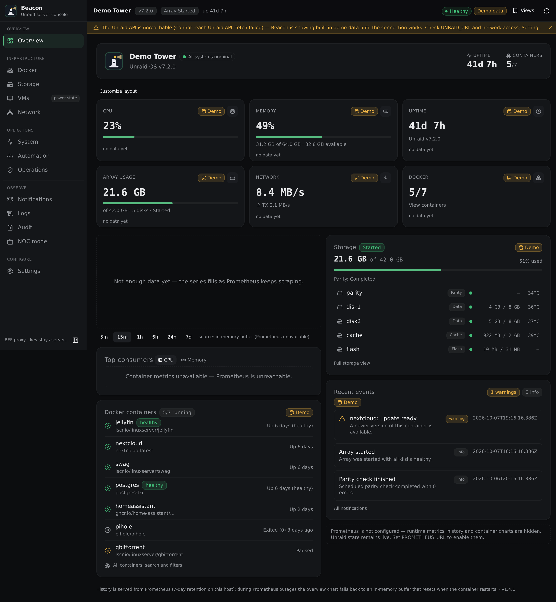

# Beacon — a modern operational dashboard for Unraid

<p align="center">
  
</p>

**Beacon** is a self-hosted, dark-first operations dashboard for Unraid servers.
One installable app for Docker operations, storage, thermal intelligence,
automation and machine-readable monitoring — with a strict security model:
your Unraid API key never leaves the server.

- **Current stable:** v0.9.12
- **Requires:** Unraid 7.x (GraphQL API), Docker
- **Installable PWA:** yes (iOS/Android/desktop)
- **License:** MIT (see [LICENSE](LICENSE))

<p align="center">
  
</p>

---

## Why Beacon

Unraid's built-in dashboards answer *what is the array doing*. Beacon answers
*what is the server doing* — container-level CPU and memory, thermal episodes
with load correlation, update provenance down to the registry digest, and a
read-only machine API — behind a BFF that keeps credentials server-side.

## Quick start

```sh
# 1. Create an Unraid API key (Settings → Management Access → API Keys)
#    with at minimum DOCKER: READ_ANY and INFO: READ_ANY (read-only).
# 2. Install the container (Unraid Docker tab) or run:
docker run -d --name unraid-dashboard \
  --network host \
  --restart unless-stopped \
  -e UNRAID_URL="http://127.0.0.1:442" \
  -e UNRAID_API_KEY="<your read-only key>" \
  -e PORT=8090 \
  -v /mnt/user/appdata/unraid-dashboard:/app/data \
  ghcr.io/cyxno/unraid-dashboard:latest
# 3. Open http://<server>:8090
```

Full walkthrough — including Prometheus, the update helper, the action key
and reverse-proxy auth: **[docs/INSTALL.md](docs/INSTALL.md)**.

## Features

| Area | Highlights |
| --- | --- |
| **Overview** | Metric cards, resource history chart, storage summary, top CPU/memory consumers, recent events, derived health with explained reasons |
| **Docker operations** | Operations-first page: searchable/filterable list, live CPU/memory, compose grouping, **Start/Stop with confirmed, SSE-verified transitions**, per-container detail, update awareness from cache (registry sweep only on demand) |
| **Storage** | Array/cache usage, per-disk status and temperatures, parity state |
| **System + thermal intelligence** | Load/CPU history, package-temperature analysis (24h + 7-day), sustained hot episodes with load/power correlation and top consumers, idle-hot detection, week-over-week trend |
| **Automation** | Opt-in pilot auto-update with proven rollback, capability-aware workflow eligibility |
| **Operations** | Update manager with **strict remote pulls and digest verification**, rollback, release provenance ("Registry verified"), helper status |
| **Observability** | Notifications, Logs, Audit trail (every mutation: actor, target, result), NOC wallboard mode |
| **Machine API** | Read-only Agent API v1 (see [docs/AGENT_API.md](docs/AGENT_API.md)) |
| **Experience** | 8 themes + accents, installable PWA, mobile-first shells, SSE live updates |

### Capability matrix

| Feature | Status | Notes |
| --- | --- | --- |
| Docker Start/Stop | supported | confirmed, SSE-verified, audit-logged |
| Docker Restart | not supported | the verified Unraid API exposes no restart mutation |
| Container updates | supported | helper-driven, policy-gated, proven rollback |
| Auto-update | opt-in pilot | allowlist + track-record + proven snapshot required |
| Agent API | read-only v1 | no write endpoints, bearer auth, rate-limited |
| Pipeline-owned projects | protected | never mutated by Beacon automation |
| iOS PWA | supported | real-device QA is operator-dependent (checklist in docs) |
| VM power actions | read-only | VM manipulation intentionally out of scope |

## Screenshots

More in [docs/screenshots/](docs/screenshots/) — captured from the built-in
demo dataset (synthetic hosts, no real data).

| | |
| --- | --- |
|  |  |

## Demo mode

Beacon ships a built-in demo fallback: when the Unraid API is unreachable the
UI renders a synthetic dataset clearly badged **Demo data** — no real
hostnames, no metrics, and every mutation path disabled. Run it locally:

```sh
docker run -d -p 3200:8090 \
  -e UNRAID_URL="http://127.0.0.1:1" \
  -e UNRAID_API_KEY="00000000000000000000000000000000" \
  ghcr.io/cyxno/unraid-dashboard:latest
```

Mutations require a separate action key plus a reachable Unraid API, so a demo
instance is read-only by construction.

## Architecture

```
Browser ──▶ Beacon (Next.js BFF) ──▶ Unraid GraphQL API
   ▲              │        └────────▶ Prometheus (metrics/history)
   │              ├────────────────▶ Update helper (isolated, only Docker socket)
   │              └────────────────▶ GHCR (release verification)
   └── SSE live updates, installable PWA
```

- The main app **never touches the Docker socket** — container facts flow
  through a tiny isolated helper.
- The browser never sees API keys; writes go through guarded, audited endpoints.
- Full diagrams and trust boundaries: [docs/ARCHITECTURE.md](docs/ARCHITECTURE.md).

## Documentation

| Document | Contents |
| --- | --- |
| [docs/INSTALL.md](docs/INSTALL.md) | prerequisites, container install, keys, Prometheus, proxy auth |
| [docs/CONFIGURATION.md](docs/CONFIGURATION.md) | every environment variable: required, default, secret? |
| [docs/UPDATING.md](docs/UPDATING.md) | strict remote updates, digest verification, rollback |
| [docs/SECURITY.md](docs/SECURITY.md) | trust model, key isolation, write boundaries |
| [docs/ARCHITECTURE.md](docs/ARCHITECTURE.md) | components, data flows, SSE, boundaries |
| [docs/AGENT_API.md](docs/AGENT_API.md) | read-only machine API v1 |
| [docs/PWA.md](docs/PWA.md) | installation, icons, iOS specifics |
| [docs/TROUBLESHOOTING.md](docs/TROUBLESHOOTING.md) | common failures and fixes |
| [CHANGELOG.md](CHANGELOG.md) | release history |
| [docs/ROADMAP.md](docs/ROADMAP.md) | direction and known limitations |
| [docs/V1_UPGRADE.md](docs/V1_UPGRADE.md) | upgrading from 0.9.x to the 1.0 line |
| [docs/RELEASE_CHECKLIST.md](docs/RELEASE_CHECKLIST.md) | release-blocker definition |
| [docs/RELEASE_NOTES_v1.md](docs/RELEASE_NOTES_v1.md) | v1.0 release notes |

## Security model (summary)

- Read-only VIEWER key for all dashboards; a **separate** action key (DOCKER
  UPDATE_ANY only) is required for Start/Stop, and only when you configure it.
- The update helper is the only component with Docker-socket access.
- Reverse-proxy auth (e.g. Authelia) with a shared secret header; direct LAN
  access is treated as trusted-local with identity headers ignored.
- Every mutation is confirmed, cooldown- and rate-limited, and audit-logged.
- Updates verify the registry digest before replacing the container and roll
  back automatically on failed health checks.

Details: [docs/SECURITY.md](docs/SECURITY.md).

## Development

```sh
npm install
npm run dev        # http://localhost:3000
npm test           # 600+ tests (node:test)
npm run lint       # eslint
npm run typecheck  # tsc --noEmit
npm run build      # production build
node scripts/visual-regression.mjs   # visual + layout gates (needs local chrome)
```

See [CONTRIBUTING.md](CONTRIBUTING.md) for the expectations and the visual
harness.

## Roadmap & limitations

Current known limits (tracked in [docs/ROADMAP.md](docs/ROADMAP.md)):
Docker restart awaits a verified Unraid API mutation; VM power actions are
intentionally out of scope; iOS PWA validation is operator-dependent. No dates
are promised.

## License

MIT — see [LICENSE](LICENSE).
